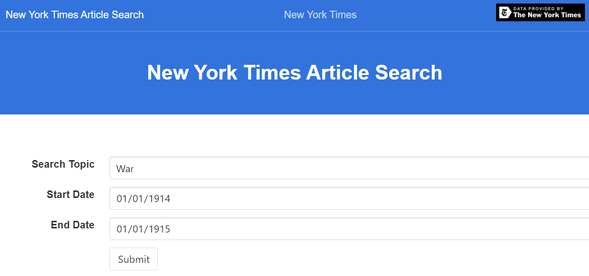
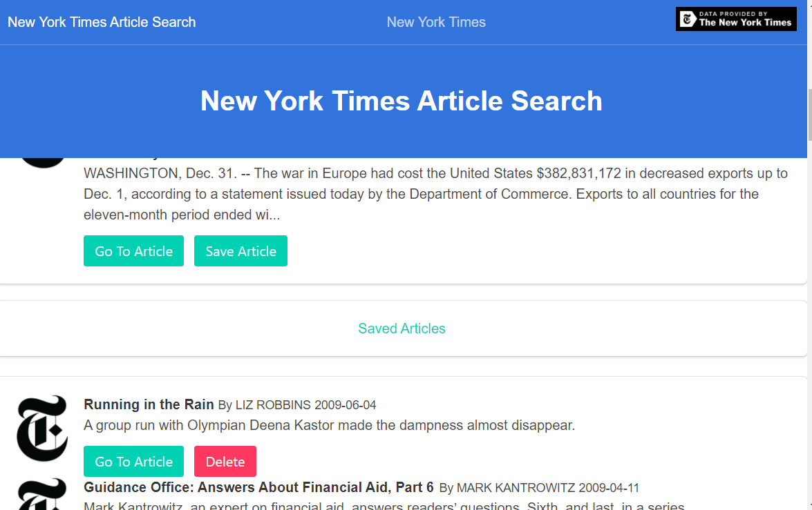

#Mongo React New York Times Webscraper
Welcome to my New York Times API Search, made with MongoDB, React, Express, Node, and styled with Bulma, and Bloomer.
This api search uses axios to search the NY times article api for articles by topic and date range.  
 
Users can save articles to a Mongo database, use links to visit the articles, and delete saved articles.
 
